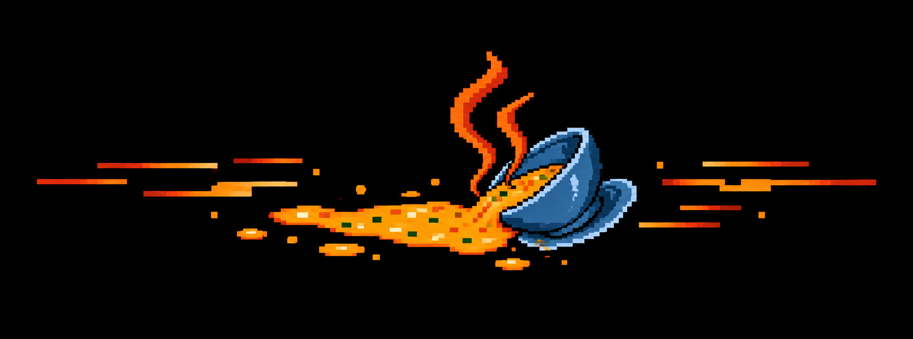
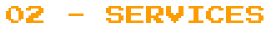
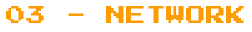
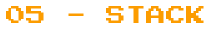

<div align="center">



### ◢◤ classic web ⟶ onchain web ⟶ agentic web ◢◤

[](https://sopa.team)
[](https://sopa.team)
[](https://base.org)
[](https://sopa.team)


</div>

<br>


> We work **both worlds**: the legacy brand that needs reach, and the protocol that
> needs a soul. We turn culture into product — campaigns across every channel,
> **autonomous AI agents** that run them, revenue that's onchain and checkable.
>
> Builders bringing an audience the new tech doesn't have, and the tooling
> the old one is missing.

<br>

<div align="center"></div>

<br>



- **AI agents & automation** — Autonomous agents that write, publish, transcode, track revenue, and run ops. Agentic marketing that works while you sleep.
- **Campaign engineering** — Multi-channel launches: Farcaster, X, Hive, Discord, Instagram, email. One brief, the copy, the calendar, the receipts.
- **Portals & tooling** — Multi-tenant dashboards: content studio, analytics, treasury, payroll, revenue tracking. A brand's marketing and its ops.
- **Onchain revenue & treasury** — Live revenue streams, 0xSplits, swappers, Superfluid payroll, staking pipelines. Auditable, not aspirational.
- **Content & culture** — Skate, BMX, surf and the communities around them. Reach that crosses from mainstream to onchain and back.

<br>

<div align="center"></div>

<br>



```txt
root@sopa:~$ sopa network --scan
> resolving allies... 7 nodes found
```

- `0x01` 🟠 **[Gnars](https://gnars.com)** — onchain, community-owned action-sports DAO
- `0x02` 🟠 **[SkateHive](https://skatehive.app)** — the skateboarding community, onchain on Hive
- `0x03` 🟠 **[Morpheus](https://mor.org)** — decentralized AI, open & permissionless inference
- `0x04` 🟠 **[Venice](https://venice.ai)** — private, uncensored AI
- `0x05` 🟠 **[Base](https://base.org)** — the onchain home we build on
- `0x06` 🟠 **[Nouns](https://nouns.wtf)** — CC0 culture funding the open internet
- `0x07` 🟠 **[KeepKey](https://keepkey.com)** — self-custody hardware wallet for crypto assets

<br>

<div align="center"></div>

<br>


```diff
+ both worlds        classic brand playbooks AND onchain/AI-native mechanics
+ agentic by default AI agents do the repetitive work, humans bring the taste
+ verifiable         splits, revenue, payroll — onchain and checkable, not vibes
+ culture-first      we're the crew, not a growth-hacking sweatshop
```

<br>

<div align="center"></div>

<br>



<div align="left">


</div>


<br>


```txt
sktbrd    rferrari    r4to    v2    bielcx
```

> builders who post, and posters who build.

<div align="center"></div>

<br><br>

<div align="center">

[](https://sopa.team)
[](mailto:crew@sopa.team)
[](https://warpcast.com/~/channel/gnars)

<br>

`from classic to onchain, human to agent — we ship in both.`

</div>
